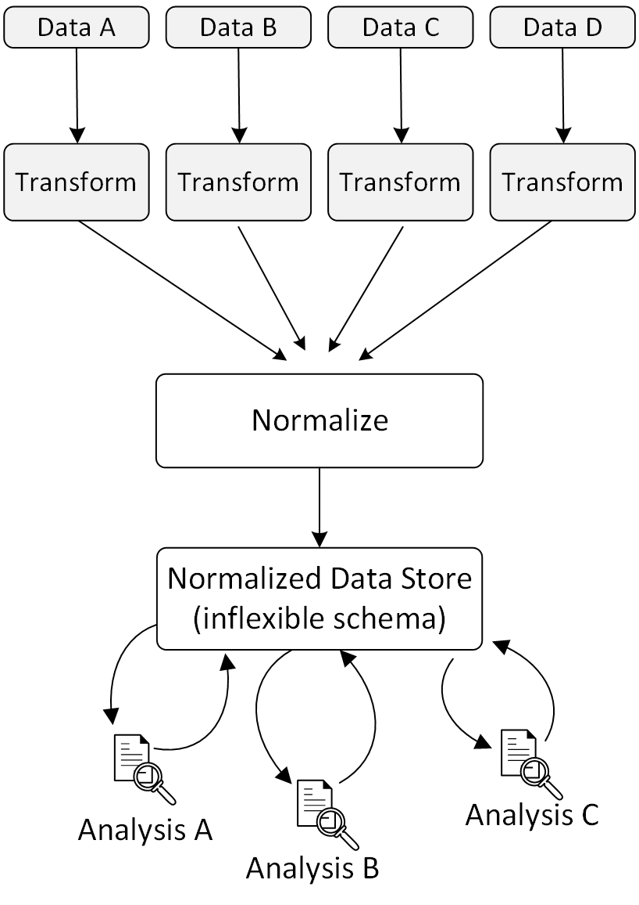
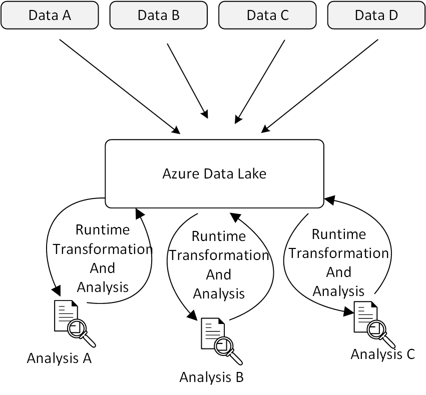
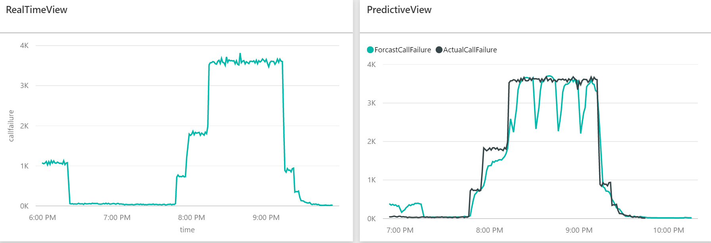

#Building Predictive Pipelines Incorporating Azure Data Lake and Azure Machine Learning

Big data is not a buzz word, but a reality. Yet another challenge is surfacing up: the number of the types of data is growing and new type of data are coming up. The data format is not just limited to text, audio, video, but also sensor data, clickstream, server logs  and many others. To deal with these new types of data, new applications need to be developed and still take their time to mature. Do you want to transform your native data to a defined structure where you don't even know what your business requirements are and throw the native data away before your applications find their ways to develop insights? The answer is of course not. And data lake comes into rescue.  

There is a trend  in industry  to extract and place data for analytics into a data lake repository without first transforming the data the way they would need to for a relational data warehouse or key-value store.
By storing data in its native format, data lake maintains data provenance and no loss of information content  resulting from the extraction, transformation and loading (ETL) process.  By shifting the process from ETL to ELT (extraction, loading and transformation), data lake uses a schema-on-read approaches, therefore eliminates the work of defining schemas before business requirements are clear and also saves greatly on computation, which is more expensive than the storage. As data volumes, data variety, and metadata richness grow, the benefit of the new approach magnifies.

Figure 1 and figure 2 below illustrates the shift from ETL to ELT.

Figure 1: Traditional Data Management and Analysis

Figure 2: Data Management and Analysis in an  Data Lake Environment.

<a href="https://azure.microsoft.com/en-us/solutions/data-lake/"/>Azure Data Lake</a>  is a Microsoft Data Lake product. It consists of <a href="https://azure.microsoft.com/en-us/documentation/services/data-lake-store/"/> Azure Data Lake Store</a> and <a href="https://azure.microsoft.com/en-us/documentation/services/data-lake-analytics/"> Azure Data Lake Analytics </a>. Azure Data Lake Store  is a data repository capable of holding an unlimited amount of data in its native, raw format, including structured, semi-structured, and unstructured data. With Azure Data Lake Analytics, you can define your schema on read by running U-SQL and implementing advanced data extraction and transformation by using C# code, which is extremely flexible. By using Azure Data Lake Analytics, the capability of running analytic on your data extends without a boundary.

In addition to Azure Data Lake, Microsoft <a href="https://www.microsoft.com/en-us/server-cloud/cortana-intelligence-suite/what-is-cortana-intelligence.aspx">Cortana Intelligence Suite</a> provides many other products, especially Azure Machine Learning to allow you to build an end-to-end advanced analytic solution on your data lake data and make Intelligent actions. Azure Machine learning provides a fully managed cloud service to build, deploy and share predictive analysis. <a href="https://azure.microsoft.com/en-us/services/event-hubs/"/>Azure Event Hub</a> and <a href="https://azure.microsoft.com/en-us/services/stream-analytics/"/> Azure Stream Analytics</a> provides highly scalable data ingestion and event processing service.<a href="https://azure.microsoft.com/en-us/documentation/articles/sql-data-warehouse-overview-what-is"/>Azure SQL Data Warehouse</a> provides high performing query on your structured data and <a href="https://powerbi.microsoft.com/en-us/"/>Power BI</a> renders visualization on your streaming data and data in your warehouse. <a href="https://azure.microsoft.com/en-us/services/data-factory/"/>Azure Data Factory</a> schedules data transformation and data movement among all the Azure services that your solution needs to use.

To demonstrate running advanced analytics on Azure Data Lake using Cortana Intelligence Suite, we have published a tutorial that shows how to build end-to-end fully operational real-time and predictive pipelines. The architecture is as follows:

Figure 1: Architecture
The use case is to show real-time call failure and  predict call failure number on a phone switch by using historical data. We use a data generator to simulate a phone switch to generate the call detail records. In the end of the solution, you should be able to see

So again, click <a href="https://github.com/Azure/CAS-Gallery-Content/tree/master/Tutorials/Data_Lake"/>here</a> to check out the tutorial and get started - and have fun with your journey into big data!

These are all the Cortana Intelligence Suite services used by the tutorial:

<a href="https://azure.microsoft.com/en-us/documentation/articles/sql-data-warehouse-overview-what-is"/>Azure SQL Data Warehouse</a> | <a href="https://azure.microsoft.com/en-us/services/machine-learning/">Azure Machine Learning</a> | <a href="https://azure.microsoft.com/en-us/services/event-hubs/"/>Azure Event Hub</a> | <a href="https://azure.microsoft.com/en-us/services/stream-analytics/"/>Stream Analytics</a> | <a href="https://powerbi.microsoft.com/en-us/"/>Power BI</a> | <a href="https://azure.microsoft.com/en-us/services/data-factory/"/>Azure Data Factory</a>
