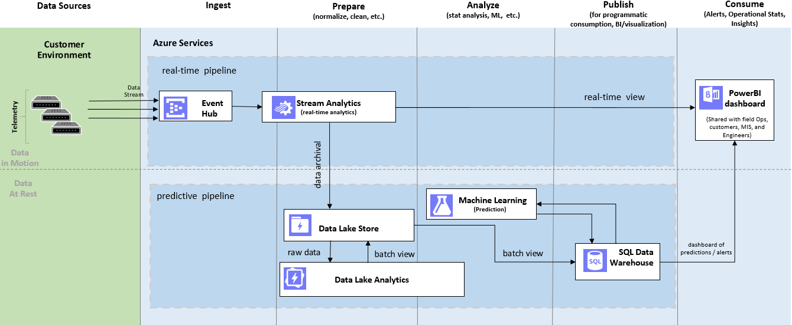

#Predictive Analysis for Telecommunication- Integrating Azure Data Lake and Azure Machine Learning

Big data is not just a buzz word. It is a reality. As the amount of data has grown in last decade, so have the solutions available to store and process the data,  along with the number of formats to describe the data.  The data format is not just limited to text, audio, video, but also sensor data, clickstream, server logs and many others. To deal with these new types of data, new applications need to be developed which take their time to mature. It is wasteful to transform your native data to a defined structure  before your business requirements are clear, and it is even more wasteful to throw  the data in native raw format away before your new applications find their ways to develop insights. With so many data sources and formats, the data storage and retrieval problem is real and tough but Azure Data Lake comes to rescue.

There is a trend in industry to extract and place data for analytics into a data lake repository without first transforming the data, which is unlike what would be needed to for a relational data warehouse or key-value store. By storing data in its native format, data lake maintains data provenance and no loss of information  resulting from the extraction, transformation and loading (ETL) process. By shifting the process from ETL to ELT (extraction, loading and transformation), a data lake uses a schema-on-read approaches, therefore eliminates the work of defining schemas before business requirements are clear and also saves greatly on computation, which is more expensive than the storage. As data volumes, data variety, and metadata richness grow, the benefit of the new approach magnifies.

Figure 1 and figure 2 below illustrates the shift from ETL to ELT.

Figure 1: Traditional Data Management and Analysis

Figure 2: Data Management and Analysis in an  Data Lake Environment.

<a href="https://azure.microsoft.com/en-us/solutions/data-lake/"/>Azure Data Lake</a>  is a fully managed on-cloud implementation of Data Lake from Microsoft. It consists of <a href="https://azure.microsoft.com/en-us/documentation/services/data-lake-store/"/> Azure Data Lake Store</a> and <a href="https://azure.microsoft.com/en-us/documentation/services/data-lake-analytics/"> Azure Data Lake Analytics</a>. Azure Data Lake Store is a data repository capable of holding an unlimited amount of data in its native, raw format, including structured, semi-structured, and unstructured data. With Azure Data Lake Analytics, you can define your extract schema on read by running U-SQL queries utilizing the power of customized C# code implemented as .NET libraries to perform advanced data extraction and transformation. By using Azure Data Lake Analytics, running analytics on your data is neither limited by the functionality provided by any query language nor as tedious as writing everything from scratch. Azure Data Lake Analytics provides enormous flexibility and extends your analytics without a boundary.

Integrating Azure Data Lake with many other products in Microsoft <a href="https://www.microsoft.com/en-us/server-cloud/cortana-intelligence-suite/what-is-cortana-intelligence.aspx">Cortana Intelligence Suite</a>, especially <a href="https://azure.microsoft.com/en-us/documentation/services/machine-learning/">Azure Machine Learning</a>, enables you to build end-to-end advanced analytics solutions and intelligent applications that impact revenue-critical decisions and actions.
 An end-to-end complete solution involves <a href="https://azure.microsoft.com/en-us/services/event-hubs/"/>Azure Event Hub</a> and <a href="https://azure.microsoft.com/en-us/services/stream-analytics/"/> Azure Stream Analytics</a> to provide highly scalable data ingestion and event processing service, uses Azure Data Lake Store to archive native data, and utilize Azure Data Lake Analytics to transform native data into structured data that can be used by Azure Machine Learning to develop business insights.   Azure Machine Learning provides a fully managed cloud service to build, deploy and share advanced analytics, including <a href="https://blogs.technet.microsoft.com/machinelearning/2016/02/23/predictive-maintenance-for-aerospace-a-cortana-analytics-solution-template/"">predictive maintenance</a>, <a href="https://blogs.technet.microsoft.com/machinelearning/2016/03/22/solution-template-for-energy-demand-forecasting/""> energy demand forecasting</a>, customer profiling, anomaly detection and many other possibilities. Advanced analytics results are stored in  <a href="https://azure.microsoft.com/en-us/documentation/articles/sql-data-warehouse-overview-what-is"/>Azure SQL Data Warehouse</a>, which  provides high-performance query on your structured data. <a href="https://powerbi.microsoft.com/en-us/"/>Power BI</a> renders visualization on your streaming data and  data in Data Warehouse to show business insights.
  <a href="https://azure.microsoft.com/en-us/services/data-factory/"/>Azure Data Factory</a> orchestrates  data transformation and data movement among all the Azure services that your solution needs to use.

To demonstrate techniques and ease of building and deploying one such intelligent solution on Azure, we have published a tutorial that shows how to build end-to-end, fully operational real-time and predictive pipelines. The architecture is as follows:

Figure 1: Architecture of Building Real-time and Predictive Analysis on Telecommunication Data

The use case is to predict a telephony network switch failure ahead of time by determining patterns in call drop rates using live and historical call description records. We use a data generator to simulate a phone switch to generate  call detail records (CDR) and employ Azure Event hub to ingest data. Two Azure Stream Analytics jobs will work on the CDR data. One will send the data to Power BI for real time visualization, and One will archive the data into Azure Data Lake Store. Azure Data Lake Analytics runs a U-SQL job to pre-process the data before sending it to SQL Data Warehouse (staging and publishing store) for Azure Machine Learning to run predictive analytics.  The AML web service imports data (dropped call aggregates) from SQL Data Warehouse and exports the prediction  back to SQL Data Warehouse. In the end of <a href="https://gallery.cortanaintelligence.com/Tutorial/b0ef9f4462774901aa208791e2a42a49">the solution</a>, you should be able to see

Click <a href="https://github.com/Azure/Cortana-Intelligence-Gallery-Content/tree/master/Tutorials/Data-Lake"/>here</a> to check out the tutorial and get started - and have fun with your journey into big data and machine learning!

These are all the Cortana Intelligence Suite services used by the tutorial:
 <a href="https://azure.microsoft.com/en-us/documentation/services/data-lake-store/"/> Azure Data Lake Store</a> | <a href="https://azure.microsoft.com/en-us/documentation/services/data-lake-analytics/"> Azure Data Lake Analytics </a> | <a href="https://azure.microsoft.com/en-us/documentation/articles/sql-data-warehouse-overview-what-is"/>Azure SQL Data Warehouse</a> | <a href="https://azure.microsoft.com/en-us/services/machine-learning/">Azure Machine Learning</a> | <a href="https://azure.microsoft.com/en-us/services/event-hubs/"/>Azure Event Hub</a> | <a href="https://azure.microsoft.com/en-us/services/stream-analytics/"/>Stream Analytics</a> | <a href="https://powerbi.microsoft.com/en-us/"/>Power BI</a> | <a href="https://azure.microsoft.com/en-us/services/data-factory/"/>Azure Data Factory</a>
