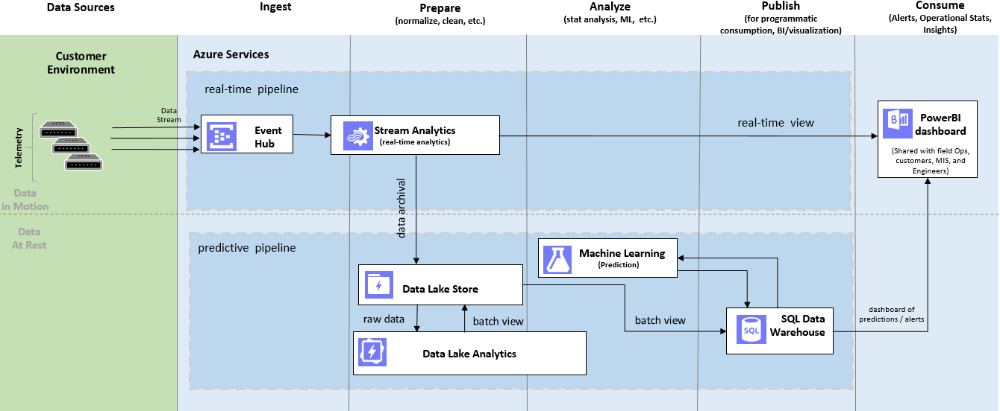
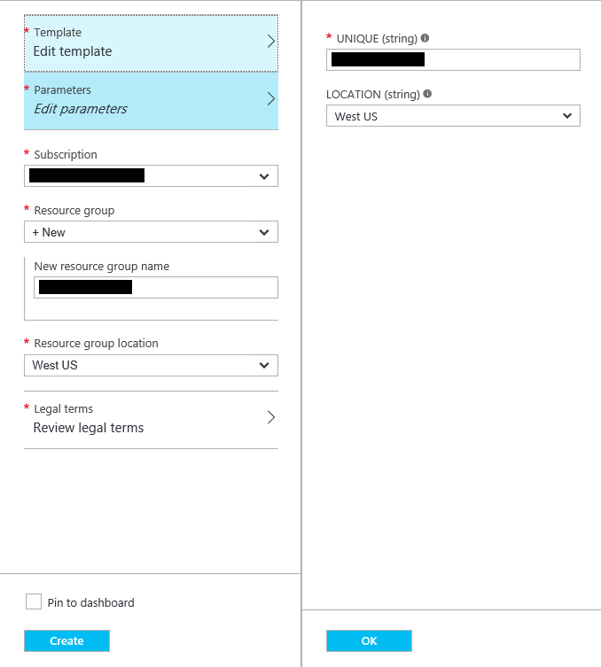
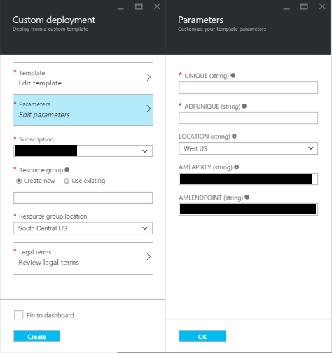

Summary
=======

An Azure Data Lake Store is a flexible, scalable repository for any type of data. It provides unlimited storage with high frequency, low latency throughput capabilities and provides immediate read and analysis capabilities over your data. Once data is captured in the Data Lake, advanced transformation and processing of the data can be performed using Microsoft's extendable and scalable U-SQL language, integrated with Azure Data Lake Analytics, Azure Machine Learning, or any HDFS compliant project, such as Hive running in HD Insight cluster.

Some of the principal benefits of an Azure Data Lake Store include:

-   Unlimited storage space

-   High-throughput read/write

-   Security through integration with Active Directory

-   Automatic data replication

-   Compatibility with the Hadoop Distributed File System (HDFS).

-   Compatibility with  HDFS compliant project (e.g. Hive, HBase, Storm,  etc.)

The objective of this tutorial is to demonstrate techniques for the movement of data between an external data source, an Azure Data Lake Store and Azure SQL Data Warehouse while demonstrating using U-SQL for processing information in a Data Lake Store and perform advanced analytic through Azure Machine Learning  (AML).

This tutorial will be developed in reference to a use case described in the following section.

Use Case
========

Switch based telephone companies, both land line and cellular, produce very large volumes of information, principally in the form of call detail records. Each telecom switch records information on the calling and called numbers, incoming and outgoing trunks, and information of the time of the call along with a number of other features.

The duration that telephone companies keep their data has varied between land line and cellular companies from one to many years. Various legislation (e.g. the USA Freedom Act) is being considered that will require telecommunication companies to hold the data for a longer period of time. The amount of data can be extremely large. If you consider a modestly sized telecom carrier with 10M customers can readily produce over 1 billion description messages per day, including call detail records (CDR) at a size close to 1 TB per day. In shortly over ½ of a year this amount of data could begin to surpass the maximum capacity of an Azure Storage blob per storage account per subscription (500TB).

In scenarios such as this, the integrated SQL and C# capabilities of U-SQL, the unlimited data storage capacity, and the ability for high velocity data ingestion of the Azure Data Lake Store makes it an ideal technical solution for the persistence and management of telephony call data.

Telecommunication network optimization techniques can hugely benefit from getting switch overload or malfunction predictions ahead of time. Such predictions help maintain SLA and overall network health by allowing for mitigating actions to be taken proactively, such as, possibly rerouting calls and avoid call drops and perhaps an eventual switch shutdown. Microsoft’s capability to manage unlimited volumes of data within an Azure Data Lake Store combined with the powerful means for interacting with the Data Lake Store through U-SQL and the predictive modeling capabilities of Azure Machine Learning (AML) readily address all of the challenges with storage compliance and provide a seamless means for impactful analysis suitable for network optimization and other interaction..


The intent of this tutorial is to provide the engineering steps necessary to capture and reproduce completely  the scenario described above.

The tutorial will include:

- The generation and ingestion of CDR Data using an Azure Event Hub and Azure Streaming Analytics.
- The creation of an Azure Data Lake Store (ADLS) to meet long term CDR management requirements.
- Using Azure Data Lake Analytics (ADLA) and Microsoft’s U-SQL to interact with the Data Lake. The ADLA U-SQL job generate aggregate view over the ingested CDR data that stored in ADLS.
- Creation and integration of staging store for storing analytics results from U-SQL and predictions from Azure Machine Learning (AML). This staging store is implemented using Azure SQL Data Warehouse (SQL DW) and provides as a backend for Power BI dashboards.
- AML model which predicts the switch overload


The focus of this tutorial is on the architecture, data transformation, and the movement of data between the different storage architectures and the Azure Machine Learning (AML) environment. While this example demonstrates techniques for integrating AML into the solution architecture, the focus is not on machine learning. The machine learning model is used in this tutorial to predict switch overload with time series analysis by using random forest method.  Machine learning can be used in telecommunication industry for effective marketing campaign, reducing infrastructure cost and maintenance effort.      

Prerequisites
=============

The steps described later in this tutorial  requires the
following prerequisites:

1)  Azure subscription with login credentials
    (https://azure.microsoft.com/en-us/)

2)  Azure Machine learning Studio subscription
    (https://azure.microsoft.com/en-us/services/machine-learning/)

3)  a Microsoft Power BI account
    (https://powerbi.microsoft.com/en-us/)

4) A local installation of <a href="https://azure.microsoft.com/en-us/documentation/articles/sql-data-warehouse-install-visual-studio/">Visual Studio with SQL Server Data Tools (SSDT)</a>


Architecture
============

Figure 1 illustrates the Azure architecture developed in this sample.


Figure 1: Architecture

Call detail record (CDR) data is generated via a data generator which simulates a phone switch and is deployed as an Azure Web Job. The CDR data is sent to an Event Hub. Azure Stream Analytics (ASA) takes in the CDR data flowed through Event hub, processes the data by using ASA SQL and sends the processed data to a) Power BI for real time visualization and b) Azure Data Lake Store for storage. Azure Data Lake Analytics runs a U-SQL job to pre-process the data before sending it to SQL Data Warehouse for Azure Machine Learning to run predictive analytics.

Predictive analytics is done by using the batch endpoint of an experiment published as a web service in the Azure Machine Learning Studio. The AML web service imports call failure number per minute from SQL Data Warehouse and exports the prediction, e.g. the scoring results back to SQL Data Warehouse. We use Azure Data Factory to orchestrates 1) U-SQL job in Azure Data Lake 2) Copy the results of the U-SQL job to SQL Data Warehouse 3) Predictive analytics in AML. The machine learning model here is used as an example experiment. You can use field knowledge and combine the available data dataset to build more advanced model to meet your business requirements.


Deploy
=====================

Below are the steps to deploy the use case into your Azure subscription. Note that to condense the steps somewhat, **>** is used between repeated actions. For example:

1. Click: **Button A**
1. Click: **Button B**

is written as

1. Click: **Button A** > **Button B**  


### Deploy Multiple Resources, including:
-----------------------------------------
1. Service Bus,
2. Event Hub,
3. Stream Analytics Job
4. SQL Server, SQL Data Warehouse,
5. Azure Storage Account
5. Azure Data Lake Store Account
6. Azure Data Lake Analytics Account

You will need a unique string to identify your deployment. We suggest you use only letter and number in this string and the length should not be greater than 9. Please open your memo file and write down "unique:[unique]" with "[unique]" replaced with your actual unique string. To get started, click the below button.

<a target="_blank" id="deploy-to-azure" href="https://portal.azure.com/#create/Microsoft.Template/uri/https%3A%2F%2Fraw.githubusercontent.com%2Fdaden-ms%2Farm%2Fmaster%2Fazuredeploy_part1.json"></a>

This will create a new "blade" in the Azure portal(https://ms.portal.azure.com).




1. Parameters
   1. Type: UNIQUE (string): **[*UNIQUE*]** (You need to select a globally unique string)
   1. Select: LOCATION: **[*LOCATION*]** (The region where everything will be deployed)
   1. Click: **OK**
1. Select: Subscription: **[*SUBSCRIPTION*]** (The Azure subscription you want to use)
1. Resource group
   1. Select: **New**
   1. Type: New resource group name: **[*UNIQUE*]** (Same as above)
1. Select: Resource group location: **[*LOCATION*]** (Same as above)
1. Click: **Review legal terms** > **Create**
1. Check: **Pin to dashboard** (If you want it on your dashboard)
1. Click: **Create**

The resource group will serve as an organizational framework for the
associated Azure services.

After deployment,  in the Azure Portal https://ms.portal.azure.com , select the “Resource Groups”
option from the menu, use the **[*UNIQUE*]** to find the resource group you just created and you will find all the resources that have just been deployed. The following table listed a few import account information and also infomation that you need to use in walking through this tutorial.  Please note that '[unique]'
should be replaed with your own unique string and '[' and ']' should not in your final infomation.

| Item   |      Value      |
|----------|:-------------:|
| service bus name space | adlservicebus[unique]|
| event hub name | adleventhub[unique]    |  
| stream analytic job output power bi| adlstreamanalytics[unique]]powerbi|
| stream analytic job output data lake| adlstreamanalytics[unique]]datalake|
| storage account name | storage[unique] |
| Data Lake Store Account Name | adls[unique]|
| Data Lake Analytic Account Name | adla[unique]|
|SQL Server name|adl-[unique].database.windows.net   |
|SQL Server user name |adluser   |
|SQL Server user password |pass@word1   |
|SQL Database Name| adlDB|
Table 1: Resources


### Create Azure SQL Data Warehouse tables

Next you need to create the matching tables in the SQL Data Warehouse. You can do this by following these steps:

1. Start Visual Studio. Note that you must have installed the SQL Server Data Tools.
1. Select: View: **SQL Server Object Explorer**
1. Right click: **SQL Server**
1. Click: **Add SQL Server...**
1. Type: Server Name: **adl-[*UNIQUE*].database.windows.net**
1. Select: Authentication: **Sql Server Authentication**
1. Type: User name: **adluser**
1. Type: Password: **pass@word1**
1. Select: Database Name: **adlDB**
1. Click: **Connect**
1. Right click: **adllDB**
1. Select: **New Query...**
1. Copy and paste:

```
  CREATE TABLE [dbo].[SwitchCallInfo] (
      [Time] datetime NOT NULL,
      [Switch] varchar(100) COLLATE Latin1_General_100_CI_AS_KS_WS NOT NULL,
      [CallCount] bigint NOT NULL,
      [CallFailure] bigint NOT NULL
  )
  WITH (CLUSTERED COLUMNSTORE INDEX, DISTRIBUTION = HASH([Time]));


  CREATE TABLE [dbo].[ForcastCallFailure] (
      [Time] datetime NOT NULL,
      [CallFailure] bigint NOT NULL
  )
  WITH (CLUSTERED COLUMNSTORE INDEX, DISTRIBUTION = HASH([Time]));
```

1. Click: **Execute**


### Create the AML service

1. Browse: http://gallery.cortanaintelligence.com/Experiment/CDR-Call-Failure-Prediction-Azure-Data-Lake-1 # You will copy this experiment from the gallery
1. Click: **Open in Studio**
1. Select: REGION: **[*REGION*]** (Up to you)
1. Select: WORKSPACE: **[*WORKSPACE*]** (Your workspace)
1. Click: **Import Data**
1. Type: Database server name: **adl-[*UNIQUE*].database.windows.net**
1. Type: Password: **pass@word1**
1. Click: **Export Data**
1. Type: Database server name: **adl-[*UNIQUE*].database.windows.net**
1. Type: Server user account password: **pass@word1**
1. Click: **RUN** > **DEPLOY WEB SERVICE**


### Edit and start the ASA job

 Browse: https://manage.windowsazure.com

#### To edit the input of the  job that output to PowerBI

1. Click: **STREAM ANALYTICS** > **adlstreamanalytics[*unique*]powerbi**
1. Click: **INPUTS**> **cdreventhubinput** >
1. Type:  EVENT HUB CONSUMER GROUP: **powerbi**
1. Click: **SAVE** > **Yes**


#### To edit the output of the  job that output to PowerBI

1. Click: **STREAM ANALYTICS** > **adlstreamanalytics[*unique*]powerbi**>**OUTPUTS**
1. Click: **DELETE** > **Yes**
1. Click: **ADD OUTPUT**
1. Select: **Power BI**
1. Click: **Next** > **Authorize Now** (Login with your credentials)
1. Type: OUTPUT ALIAS: **callinfoperminute**
1. Type: DATASET NAME: **callinfoperminute** (This dataset will be overwritten in PBI should it already exist)
1. Type: TABLE NAME: **callinfoperminute**
1. Select: WORKSPACE: **My Workspace** (Default)
1. Click: **Finish** > **Start** > **Finish** (You do not need to specify a custom time)

Browse: https://manage.windowsazure.com

####To edit the input of the  job that output to Data Lake

1. Click: **STREAM ANALYTICS** > **adlstreamanalytics[*unique*]datalake**
1. Click: **INPUTS**> **datalakestoreoutput** >
1. Type:  EVENT HUB CONSUMER GROUP: **datalake**
1. Click: **SAVE** > **Yes**

#### To edit the output of the  job that output to Data Lake

1. Click: **STREAM ANALYTICS** > **adlstreamanalytics[*unique*]datalake**>**OUTPUTS**
1. Click: **DELETE** > **Yes**
1. Click: **ADD OUTPUT**
1. Select: **Data Lake Store**
1. Click: **Next** > **Authorize Now** (Login with your credentials)
1. Click: **Next**
1. Type: OUTPUT ALIAS: **datalakestoreoutput**
1. Select DATA LAKE STORE ACCOUNT: **adls[unique]**
1. Type: PATH PREFIX PATTERN: **/cdrdata/input/{date}/{time}**
1. Select DATE FORMAT: **YYYY/MM/DD**
1. Select TIME FORMAT: **HH**
1. Click: **Next**
1. Select OUTPUT Format: CSV
1. Click: **Next**
1. Click: **Finish** > **Start** > **Finish** (You do not need to specify a custom time)


### Deploy the data generator as a Web Job

1. Download data generator: https://github.com/daden-ms/arm/blob/master/datagenerator.zip, Click raw and the file will be downloaded
1. Unzip: **datagenerator.zip**
1. Edit: **cdr-gen.exe.config**
1. Replace: EVENTHUBNAME: With: **adleventhub[*UNIQUE*]**
1. Get CONNECTION STRING
    1. Browse: https://manage.windowsazure.com (Get the endpoint)
    1. Click: SERVICE BUS
    1. Select: **adlservicebus[*UNIQUE*]**
    1. Click: CONNECTION INFORMATION
    1. Copy: CONNECTION STRING
1. Find: key Microsoft.ServiceBus.ConnectionString : replace its value With: CONNECTION STRING;TransportType=Amqp
1. Zip: **datagenerator.zip**
1. Browse: https://manage.windowsazure.com
1. Click: **NEW** > **COMPUTE** > **WEB APP** > **QUICK CREATE**
1. Type: URL: **adl[*UNIQUE*]**
1. Select: APP SERVICE PLAN: From your subscription
1. Click: **adl[*UNIQUE*]** > **WEBJOBS** > **ADD A JOB**
1. Type: NAME: **adl[*UNIQUE*]**
1. Browse: **datagenerator.zip**
1. Select: HOW TO RUN: **Run continuously**
1. Click: **Finish**


### Upload U-SQL script to Azure Blob Storage

Download the script from https://github.com/daden-ms/arm/blob/master/script/cdrSummary.txt, and save it to a folder with name "script"

Download Microsoft Azure Storage Explorer, login with your credentials, and  

1. Select the storage account:**storage[*unique*]**
1. Right Click  **"Create Blob container"**
1. Type: **cdrdata**
1. Right click **cdrdata**
1. Select **Open Blob Container Editor**
1. On the top of the right panel, Click **Upload**, Select **Upload Folder** and upload the script folder

### Create Data Factory


To get started, click the below button.

<a target="_blank" id="deploy-to-azure" href="https://portal.azure.com/#create/Microsoft.Template/uri/https%3A%2F%2Fraw.githubusercontent.com%2Fdaden-ms%2Farm%2Fmaster%2Fazuredeploy_part2.json"></a>

This will create a new "blade" in the Azure portal(https://ms.portal.azure.com).

This will create a new "blade" in the Azure portal.



1. Parameters
   1. Type: UNIQUE (string): **[*UNIQUE*]** (Use the one previously entered)
   1. Type: ADFUNIQUE (string): **Azure Data Factory(ADF) Identifier** (Use a number)
   1. Select: LOCATION: **[*LOCATION*]** (Use the one previously selected)
   1. Type: AZUREMLENDPOINT: **[*AZUREMLENDPOINT*]**
	    1. Browse: https://studio.azureml.net
	    1. Click: **WEB SERVICES** > **CDR Call Failure Prediction (Azure Data Lake)** > **BATCH EXECUTION**
	    1. Copy: POST: **REQUEST URI** (Everything from "https" up to and including "jobs")
   1. Type: AZUREMLAPIKEY: **[*AZUREMLAPIKEY*]**
	    1. Browse: https://studio.azureml.net
	    1. Click: **WEB SERVICES** > **CDR Call Failure Prediction (Azure Data Lake)**
	    1. Click: Copy: **API key**
   1. Click: **OK**
1. Select: Subscription: **[*SUBSCRIPTION*]** (Use the one previously selected)
1. Select: Resource group: **[*UNIQUE*]** (Use the one previously selected)
1. Click: **Review legal terms** > **Create**
1. Check: **Pin to dashboard** (If you want it on your dashboard)
1. Click: **Create**

## Add Azure Data Lake Store Linked Service
1. Browse: https://portal.azure.com
1. Click: **Data factories** > **dataFactory[*UNIQUE*]** > **Author and deploy**
1. Hover mouse over the icon, stop at **New Data Store**, Click *New Data Store**, Select "Azure Data Lake Store"
1. Copy

```
  {
      "name": "AzureDataLakeStoreLinkedService",
      "properties": {
          "type": "AzureDataLakeStore",
          "description": "",
          "typeProperties": {
              "authorization": "<Click 'Authorize' to allow this data factory and the activities it runs to access this Data Lake Store with your access rights>",
              "dataLakeStoreUri": "https://adls[unique].azuredatalakestore.net/webhdfs/v1",
              "sessionId": "<OAuth session id from the OAuth authorization session. Each session id is unique and may only be used once>"
          }
      }
  }
```

To the Editor, replace [unique] with your unique string

1. Click **Authorize**, input your credentials
1. Click: **Deploy**


## Add Azure Data Lake Analytic Linked Service
1. Hover mouse over the icon, stop at **New Compute**, Click *New Data Store**, Select "Azure Data Lake Analytics"
1. Copy


```  
{
      "name": "AzureDataLakeAnalyticsLinkedService",
      "properties": {
          "type": "AzureDataLakeAnalytics",
          "description": "",
          "typeProperties": {
              "authorization": "<Authorization code is automatically retrieved after clicking 'Authorize' and completing the OAuth login>",
              "accountName": "adla[unique]",
              "sessionId": "<OAuth session id from the OAuth authorization session. Each session id is unique and may only be used once>"
          }
      }
  }
```
To the Editor, replace [unique] with your unique string

1. Click **Authorize**, input your credentials
1. Click: **Deploy**

Wait until the upper two linked service are deployed by using the portal to check provision state.

## Add Azure Data Lake Data Sets
1. Hover mouse over the icon, stop at **New Data Set**, Click *New Data Store**, Select "Azure Data Lake Store"
1. Copy the content from https://github.com/daden-ms/arm/blob/master/dataset/DataLakeTable.json in to the Editor
1. Click: **Deploy**

1. Hover mouse over the icon, stop at **New Data Set**, Click *New Data Store**, Select "Azure Data Lake Store"
1. Copy the content from https://github.com/daden-ms/arm/blob/master/dataset/DataLakeCDRAggregateTable.json in to the Editor
1. Click: **Deploy**

## Add Data Pipelines
1. Hover mouse over the icon, stop at **New Pipeline**
1. Copy the content from https://github.com/daden-ms/arm/blob/master/pipeline/DataLakeCDRSummary.json in to the Editor
1. Edit: start: **2016-05-12T00:00:00Z**: to: Your current time in UTC 24 hour clock (for example http://www.timeanddate.com/worldclock/timezone/utc)
1. Edit: end: **2016-05-12T00:00:00Z**: to: Your current time in UTC 24 hour clock plus three hours (for example http://www.timeanddate.com/worldclock/timezone/utc)
1. Edit: **"isPaused": true** : to **"isPaused": false**
1. Click: **Deploy**

1. Hover mouse over the icon, stop at **New Pipeline**
1. Copy the content from https://github.com/daden-ms/arm/blob/master/pipeline/DataLakeStoreToSqlDW.json in to the Editor
1. Edit: start: **2016-05-12T00:00:00Z**: to: Your current time in UTC 24 hour clock (for example http://www.timeanddate.com/worldclock/timezone/utc)
1. Edit: end: **2016-05-12T00:00:00Z**: to: Your current time in UTC 24 hour clock plus three hours (for example http://www.timeanddate.com/worldclock/timezone/utc)
1. Edit: **"isPaused": true** : to **"isPaused": false**
1. Click: **Deploy**

## Start Machine Leanring Pipeline
1. Expand: **Pipelines**
1. Select: **MLPipeline**
1. Edit: start: **2016-05-12T00:00:00Z**: to: Your current time in UTC 24 hour clock (for example http://www.timeanddate.com/worldclock/timezone/utc)
1. Edit: end: **2016-05-12T00:00:00Z**: to: Your current time in UTC 24 hour clock plus three hours (for example http://www.timeanddate.com/worldclock/timezone/utc)
1. Edit: **"isPaused": true** : to **"isPaused": false**
1. Click: **Deploy**


## Create the PBI dashboard

At the end of this section, you will have a dashboard which looks like the following:


### Realtime visualization

1. Browse: https://powerbi.microsoft.com
1. Click: **Sign in** (Login with your credentials)
1. Show: The navigation pane,
1. Scroll to the bottom to the section of **Datasets**
1. Click: **callinfoperminute** > **Line chart** # Under Visualizations)
1. Select: **Time**
1. Select: **CallFailure**
1. Select: **CallCount**
1. Click: Editor icon under Visualizations
1. Click: Down icon on Title
1. Type *RealTimeView* to Title Text
1. Click **Pin visual** (pin icon on upper-right)
1. Click: Editor icon under Visualizations
1. Type *RealTimeView* for the report name
1. Click *Save and Continue**
1. Select: **New dashboard**
1. Type: Name: **CallInfoDashBoard**
1. Click: **Pin**

1. Select: **New dashboard**
1. Type: Name: **CallInfoDashBoard**
1. Click: **Pin**


1. Click *Save**
1. Type *RealTimeView* for the report name
1. Click **Pin visual** (pin icon on upper-right)
1. Select: **New dashboard**
1. Type: Name: **CallInfoDashBoard**
1. Click: **Pin**

### Predictive visualization

1. Download the Power BI Desktop application (https://powerbi.microsoft.com/en-us/desktop)
1. Download the Power BI template file and open it with Power BI application
1. On the application ribbon menu, choose Edit Queries
1. Go to *Query Settings* on the right pane, double click *Source*

In the SQL Server Database dialog  
1. Type: Server Name: **adl-[*UNIQUE*].database.windows.net**
1. Type: Database Name: **adlDB**
1. Click OK
1. On the application ribbon menu, click "Close and Apply"
1. Once data is loaded, On the application ribbon menu, click "Publish"
1. When prompt with dialog windows, click "Save"


1. Browse: https://powerbi.microsoft.com
1. Click: **Sign in** (Login with your credentials)
1. Show: The navigation pane,
1. Scroll to the bottom to the section of **Datasets**
1. Right Click: **DataLake_CDR_Predictive**
1. Click: *Dataset Settings*
1. Click: Edit credentials
1. Input: *adluser* as user name and *pass@word1* as password
1. Click: **DataLake_CDR_Predictive** > **Line chart** # Under Visualizations)
1. Select: **Time**
1. Select: **ForcastCallFailure**
1. Select: **ActualCallFailure**
1. Click: Editor icon under Visualizations
1. Click: Down icon on Title
1. Type *PredictiveView* to Title Text
1. Click **Pin visual** (pin icon on upper-right)
1. Type *PredictiveView* for the report name
1. Click *Save and Continue**
1. Type *PredictiveView* for the report name
1. Select: **Existing dashboard**
1. Choose: Name: **CallInfoDashBoard**
1. Click: **Pin**


###Summary
==========
Congratulations! If you made it to this point, you should have a running sample with real time and predictive pipelines showcasing the power of Azure Data Lake Store and its integration with Azure Machine Learning and  many of the other Azure services. The next section lists the steps to tear things down when you are done.


###Undeploy
1. Delete Resources (Service Bus, Event Hub, SQL Data Warehouse, Data Factories)
    1. Browse: https://portal.azure.com
    1. Click: **Resource groups**
    1. Right click: **[*UNIQUE*]** (your resource group)
    1. Select: **Delete**
1. Delete WebApp (data generator)
    1. Browse: https://manage.windowsazure.com
    1. Click: **WEB APPS**
    1. Select: **[*UNIQUE*]datagenerator** (Your web app)
    1. Click: **DELETE**
1. Delete AML Service
    1. Browse: https://studio.azureml.net
    1. Click: **WEB SERVICES**
    1. Select: **CDR Call Failure Prediction (Azure Data Lake)**
    1. Click: **DELETE** > **EXPERIMENTS**
    1. Select: **CDR Call Failure Prediction (Azure Data Lake)**
    1. Click: **DELETE**
1. Delete PBI dashboard
    1. Browse: https://powerbi.microsoft.com
    1. Select: **Dashboards**
    1. Right click: **CallInfoDashBoard**
    1. Select: **REMOVE**
    1. Scroll to **Reports**
    1. Right click: **PredictiveView**
    1. Select: **REMOVE**
    1. Scroll to **Reports**
    1. Right click: **RealTimeView**
    1. Select: **REMOVE**
    1. Scroll to **Datasets**
    1. Right click: **DataLake_CDR_Predictive**
    1. Select: **REMOVE**
    1. Scroll to **Datasets**
    1. Right click: **callinfoperminute**
    1. Select: **REMOVE**
